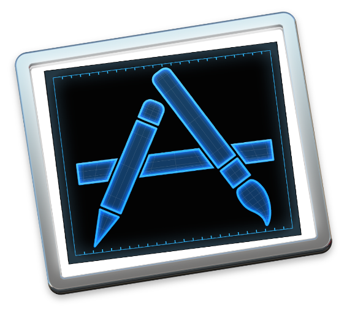

#关于Instruments
-------------------------------

Instruments是一个强大而灵活的性能分析和测试工具，它是Xcode工具集的一部分。它旨在帮助您分析OS X和iOS应用程序、进程和设备，以更好地理解和优化其行为和性能。从一开始就将Instruments纳入到您的应用程序开发中，可以帮助您在开发的早期发现问题，从而为您节省时间。

在Instruments中，您可以使用称为Instruments的专用工具随时跟踪应用程序、流程和设备的不同方面。Instruments收集数据，并将结果详细显示给您分析。

与其他性能和调试工具不同，Instruments允许您广泛收集不同类型的数据并将其并排查看。更容易识别那些可能被忽略的信息。例如，您的应用程序可能会出现由多个开放网络连接引起的内存大增长。通过一起使用“Allocations和Connections”工具，您可以识别那些未关闭从而导致内存快速增长的连接。

通过有效使用Instruments，您可以：
* 检查一个或多个应用程序或进程的行为
* 检查设备特定的功能，如Wi-Fi和蓝牙
* 在模拟器或真机上执行分析
* 创建自定义DTrace工具来分析系统和应用行为的各个方面
* 追踪源代码中的问题
* 对您的应用进行性能分析
* 在您的应用程序中查找内存问题，如泄漏的内存、废弃的内存和僵尸对象
* 找出优化您的应用以获得更高能效的方法
* 执行一般的系统级故障排除
* 将仪器配置保存为模板

虽然它嵌入在Xcode中并可能被使用，但Instruments是一个独立的应用程序，可以根据需要独立使用。

>笔者注： 

>泄漏的内存(Leaked memory)： Memory unreferenced by your application that cannot be used again or freed (also detectable by using the Leaks instrument).

>废弃的内存(Abandoned memory)： Memory still referenced by your application that has no useful purpose.

>僵尸内存(Zombie objects)：

>缓存的内存(Cached memory)：Memory still referenced by your application that might be used again for better performance.

--------------------------------------------

下一篇：[Instruments工作流程](Instruments工作流程.md)